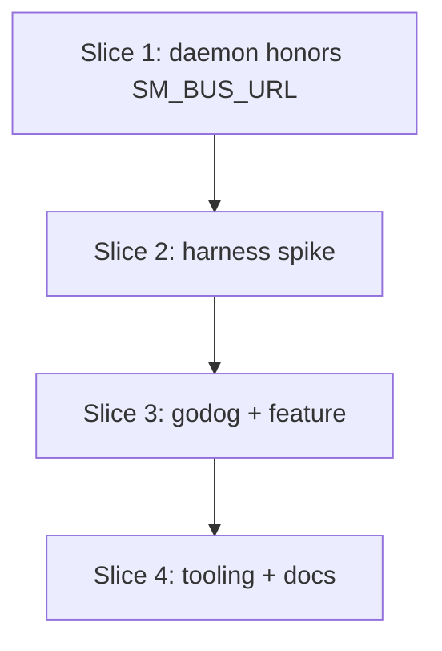

# Plan: Introduce BDD scenarios (Gherkin + godog)

**Created**: 2026-06-09
**Branch**: main
**Status**: implemented

## Goal

Add executable BDD scenarios to the repo so observable behavior is specified in
Gherkin and verified end to end against the real `sm` binary. The first feature
covers session-start visibility: when a new agent session starts, `sm` knows
about it — it appears in the session list with the right agent, directory, and
state, without raising a false "needs attention" alert. The scenarios run
through the production path (`sm hook claude` stdin JSON → NATS (token-auth) →
daemon → SQLite → `sm ls`), fully isolated from the live daemon and real user
data.

Tooling: [godog](https://github.com/cucumber/godog) (the official Cucumber
implementation for Go), wired into `go test` via `godog.TestSuite` so
`go test ./...` runs the scenarios with no extra runner.

**Note on current tree state**: bus token auth (`bus.EnsureToken`/`LoadToken`,
`bus.URL()` reading `SM_BUS_URL`) landed today as uncommitted work-in-progress
from the NATS-remote effort. This plan builds on it: clients already honor
`SM_BUS_URL`; only the daemon's embedded-server bind address is still
hardcoded.

## Acceptance Criteria

- [ ] Gherkin `.feature` files live in the repo and are executed by `go test ./...` (skipped under `-short` via `t.Skip`, observable as `--- SKIP` with no daemon spawned).
- [ ] **Merge gate**: the happy-path scenario — a session started via `sm hook claude` appears in `sm ls` with agent `claude`, the scenario's directory, and state `idle` — passes end to end against the built `sm` binary.
- [ ] Scenarios cover: duplicate-start (resume/clear) not double-listed, compact-restart discarded by the hook before the bus, new session not counted as waiting, invalid hook JSON harmless (hook exits 0, no session), hook exits 0 when no daemon is running.
- [ ] BDD runs are hermetic: per-scenario temp `XDG_DATA_HOME`/`XDG_STATE_HOME` propagated to **every** `sm` subprocess (daemon, hook, ls) so they share the per-scenario bus token at `$XDG_DATA_HOME/sm/bus-token`; daemon bound to a non-default port via `SM_BUS_URL`; `~/.local/share/sm` and the live daemon untouched.
- [ ] Harness failures are diagnosable: daemon readiness has an explicit timeout that fails with the captured daemon stderr; per-scenario daemon stderr is attached to step failure messages.
- [ ] `task bdd` runs the suite; CLAUDE.md documents the authoring workflow.

## Slices

### Slice 1: Daemon binds embedded NATS from `bus.URL()`

**Depends-on:** none
**Files:** `internal/bus/bus.go`, `internal/bus/bus_test.go`, `internal/daemon/daemon.go`

**Behavior:**

Clients (`cli`, `hook`) already dial `bus.URL()`, which honors `SM_BUS_URL`.
The daemon still hardcodes `startEmbeddedNATS("127.0.0.1", 4222, token)`
(`daemon.go:58`), so setting `SM_BUS_URL` today splits the system: clients dial
the override while the server binds 4222. Close that gap — no new env var.

```gherkin
Feature: Bus address override

  Scenario: Default address when no override is set
    Given SM_BUS_URL is not set
    When the daemon starts
    Then its embedded bus listens on 127.0.0.1:4222

  Scenario: Daemon and clients agree on the override
    Given SM_BUS_URL is set to a non-default localhost address
    When the daemon starts
    And a hook publishes an event
    Then the daemon serves and the hook publishes on that same address
```

**Steps:**

#### Step 1.1: `bus.HostPort` + daemon wiring

**Complexity**: standard
**RED**: Unit tests for `bus.HostPort(rawURL string) (host string, port int, err error)`: `DefaultURL` → `127.0.0.1`, `4222`; `nats://127.0.0.1:14222` → `127.0.0.1`, `14222`; missing/non-numeric port and unparsable URL → error. Daemon-level test: with `SM_BUS_URL` set to a free non-default port (`t.Setenv`), `startEmbeddedNATS` from parsed values accepts a `bus.Connect` to that URL with the token.
**GREEN**: Add `bus.HostPort` (≤10 lines: `net/url.Parse` + `strconv.Atoi`); `daemon.Run` calls `bus.HostPort(bus.URL())` and passes the result to `startEmbeddedNATS`. The existing port-range guard in `startEmbeddedNATS` keeps applying to the parsed value.
**REFACTOR**: None needed.
**Files**: `internal/bus/bus.go`, `internal/bus/bus_test.go`, `internal/daemon/daemon.go`, `internal/daemon/daemon_test.go`
**Commit**: `daemon: bind embedded NATS to the SM_BUS_URL host/port`

### Slice 2: Hermetic harness spike (no Gherkin yet)

**Depends-on:** 1
**Files:** `bdd/world_test.go`, `bdd/harness_test.go`

**Behavior:**

De-risk the two open assumptions before any Gherkin exists: (a) a per-scenario
daemon subprocess can be started hermetically and torn down cleanly; (b) the
liveness fingerprint of hook-emitted sessions resolves to the long-lived
`go test` process, so `sm ls`'s reap pass does not spuriously kill BDD
sessions. Plain Go tests; deleted-from-the-spotlight once godog lands on top.

Harness contract (also the fix for the review blockers):

- `TestMain` builds `sm` once (`go build -o <tmp>/sm ./cmd/sm`), capturing
  combined output; on failure it exits via
  `log.Fatalf("failed to build sm binary:\n%s", out)` so a compile error reads
  as a build error, not a harness mystery.
- Per scenario/test: fresh temp `XDG_DATA_HOME` + `XDG_STATE_HOME`; free
  localhost port via a concrete `pickFreePort` fixture (listen on `:0`, close,
  reuse; up to 3 attempts with daemon-startup retry to absorb the TOCTOU
  window); start `<tmp>/sm daemon` with
  `SM_BUS_URL=nats://127.0.0.1:<port>` **and both XDG vars** in its env.
- The same env (XDG vars + `SM_BUS_URL`) is set on **every** `sm` subprocess
  the harness launches, so hook/ls read the daemon's per-scenario token from
  `$XDG_DATA_HOME/sm/bus-token` and auth succeeds.
- Readiness: poll a token-auth `bus.Connect` until success, 5s deadline; on
  timeout fail with the port and the daemon's captured stderr.
- Daemon stderr is captured per scenario and attached to any failure message.
- Teardown: SIGTERM, wait with deadline, SIGKILL fallback.
- World stays lifecycle-only (binary path, dirs, port, daemon cmd, env);
  fixtures and assertion helpers live in separate files; step functions are
  one-liners over them.

**Steps:**

#### Step 2.1: Daemon lifecycle harness

**Complexity**: complex
**RED**: Go test (in `bdd`, skipped under `testing.Short()`): start the per-test daemon, expect a token-auth `bus.Connect` to succeed within the readiness deadline, teardown leaves no process behind. Fails — no harness exists.
**GREEN**: Implement `TestMain` build + world lifecycle per the contract above.
**REFACTOR**: None needed beyond keeping world lifecycle-only.
**Files**: `bdd/world_test.go`, `bdd/harness_test.go`
**Commit**: `bdd: hermetic per-test daemon harness`

#### Step 2.2: Liveness assumption pinned

**Complexity**: standard
**RED**: Go test: pipe a Claude `SessionStart` JSON into `<tmp>/sm hook claude` (harness env), then run `<tmp>/sm ls` repeatedly for >1 reap pass; the session must remain listed (not reaped to `dead`).
**GREEN**: Expected to pass as-is (the hook's durable-ancestor walk lands on the `go test` process, which outlives the test). If it does not, make the fallback part of the design now: a per-scenario long-lived child process whose pid the hook fingerprints. Document the verified outcome in a comment in `world_test.go`.
**REFACTOR**: None needed.
**Files**: `bdd/harness_test.go`, `bdd/world_test.go`
**Commit**: `bdd: verify hook-fingerprinted sessions survive the reaper in tests`

### Slice 3: godog + session-start feature

**Depends-on:** 2
**Files:** `bdd/bdd_test.go`, `bdd/steps_test.go`, `bdd/fixtures_test.go`, `bdd/features/session-start.feature`, `go.mod`

**Behavior:**

```gherkin
Feature: Knowing when a new agent session starts
  As someone running multiple AI coding agents
  I want sm to notice the moment a new session starts
  So that every live session is visible without me registering anything

  Background:
    Given the session manager is running

  Scenario: A brand-new session appears in the session list
    When a claude session with native id "sess-abc" starts in "project-a"
    Then the session list contains exactly 1 session
    And that session is a "claude" session in "project-a"
    And that session's state is "idle"

  Scenario: A newly started session does not demand attention
    When a claude session with native id "sess-abc" starts in "project-a"
    Then the waiting-session count is 0

  Scenario: A session that starts again after a resume is not listed twice
    Given a claude session with native id "sess-abc" has started in "project-a"
    When a claude session with native id "sess-abc" starts again as a resume
    Then the session list contains exactly 1 session
    And that session's state is "idle"

  Scenario: A session that starts again after a /clear is not listed twice
    Given a claude session with native id "sess-abc" has started in "project-a"
    When a claude session with native id "sess-abc" starts again after a /clear
    Then the session list contains exactly 1 session
    And that session's state is "idle"

  Scenario: A context-compaction restart never reaches the session manager
    Given a claude session with native id "sess-abc" has started in "project-a"
    When a claude session with native id "sess-abc" restarts due to context compaction
    Then the hook exits successfully
    And the event count for the session is unchanged
    And the session list contains exactly 1 session

  Scenario: Sessions from different agents are tracked separately
    When a claude session with native id "sess-abc" starts in "project-a"
    And an opencode session with native id "oc-1" starts in "project-b"
    Then the session list contains exactly 2 sessions
    And the list contains an "opencode" session in "project-b" with state "idle"

  Scenario: Invalid agent output creates no session
    When an agent sends a start notification that is not valid JSON
    Then the hook exits successfully
    And the session list contains exactly 0 sessions

  Scenario: A hook fired while the session manager is down does not disturb the agent
    Given the session manager is not running
    When a claude session with native id "sess-abc" starts in "project-a"
    Then the hook exits successfully
```

Step-definition contract (not in the feature text):

- "a claude session … starts" pipes realistic Claude `SessionStart` hook JSON
  (`session_id` = the named native id, `cwd` = scenario temp dir for the named
  project, `source` = `startup`/`resume`/`compact`/`clear` per step) into
  `<tmp>/sm hook claude` via `exec.Cmd` with the scenario env.
- "the event count for the session is unchanged": read via `sm show` (the
  session is resolvable by its UUID captured from `sm ls` in the Given); the
  list count is the end-to-end guard.
- List/count assertions poll `sm ls`/`sm show` output until the expectation
  holds or a 2s deadline passes (event delivery is async); on failure the
  message includes the last output and the daemon stderr.
- "the waiting-session count is 0" reads
  `$XDG_STATE_HOME/sm/waiting-count` and asserts the file **exists with
  content `0`** (absence is a failure, not a pass).
- "the hook exits successfully" asserts OS exit code 0 of the real binary;
  for the invalid-JSON scenario, "invalid" strictly means malformed JSON (the
  unrecognized-event and missing-id paths stay covered by hook unit tests).

**Steps:**

#### Step 3.1: godog wiring + happy-path scenario (merge gate)

**Complexity**: standard
**RED**: Add `godog` dep, `bdd_test.go` with `godog.TestSuite` (skips under `testing.Short()`), and the feature file with only the first scenario; `go test ./bdd` fails with undefined steps.
**GREEN**: Implement the four steps for the happy path on top of the slice-2 world; scenario passes.
**REFACTOR**: None needed.
**Files**: `bdd/bdd_test.go`, `bdd/steps_test.go`, `bdd/features/session-start.feature`, `go.mod`
**Commit**: `bdd: godog suite + session-start happy path`

#### Step 3.2: Remaining session-start scenarios

**Complexity**: standard
**RED**: Add the seven remaining scenarios; run — undefined/failing.
**GREEN**: Implement the remaining steps per the contract above (waiting-count reader, resume/clear/compact restarts with the same native id, opencode start with attribution assertion, malformed stdin via the real binary, daemon-down scenario skips daemon startup in its Given).
**REFACTOR**: Deduplicate hook-JSON construction into `fixtures_test.go` builders.
**Files**: `bdd/steps_test.go`, `bdd/fixtures_test.go`, `bdd/features/session-start.feature`
**Commit**: `bdd: cover duplicate start, compaction, waiting count, invalid input, daemon-down`

### Slice 4: Tooling + docs wiring

**Depends-on:** 3
**Files:** `Taskfile.yml`, `CLAUDE.md`, `README.md`

**Behavior:**

Decision (explicit, per review): `task test` **stays fast** (`go vet` +
`go build`); the full suite remains `go test ./...` (which now includes BDD);
`task bdd` is the dedicated BDD entry point. CLAUDE.md documents the
two-command workflow.

```gherkin
Feature: Running the BDD suite

  Scenario: Dedicated task runs the scenarios
    When a developer runs "task bdd"
    Then the godog scenarios execute and report per-scenario results

  Scenario: Quick test runs stay fast
    When a developer runs "go test -short ./..."
    Then the BDD test function reports SKIP and no sm daemon process is started
```

**Steps:**

#### Step 4.1: `task bdd` + authoring docs

**Complexity**: trivial
**RED**: `task bdd` does not exist (command fails).
**GREEN**: Add `bdd` task using godog's progress format (`go test ./bdd -godog.format=progress`) so passing runs stay one-dot-per-step and failures print in full — no unconditional `-v` wall of text. CLAUDE.md authoring section covers: (a) where `.feature` files live, (b) the world/fixture helpers available to step functions, (c) a minimal new-feature recipe (file skeleton + one step), (d) running a single scenario — lead with the untagged name-filter form using a real scenario name from the feature file (`go test ./bdd -run 'TestFeatures/A_brand-new_session…'` / `-godog.filter`), mention `-godog.tags` only as the option for tagged scenarios. README gets a one-line pointer.
**REFACTOR**: None needed.
**Files**: `Taskfile.yml`, `CLAUDE.md`, `README.md`
**Commit**: `bdd: task target and authoring docs`

## Parallelization



| Wave | Slices (parallel) |
|------|-------------------|
| 1 | 1 |
| 2 | 2 |
| 3 | 3 |
| 4 | 4 |

(Derived by hand: `plan-waves.sh` is absent from this plugin install. Linear
chain, one slice per wave — no same-wave collisions possible.)

## Complexity Classification

| Rating | Criteria | Review depth |
|--------|----------|--------------|
| `trivial` | Single-file rename, config change, typo fix, documentation-only | Skip inline review; covered by final `/code-review` |
| `standard` | New function, test, module, or behavioral change within existing patterns | Spec-compliance + relevant quality agents |
| `complex` | Architectural change, security-sensitive, cross-cutting concern, new abstraction | Full agent suite including opus-tier agents |

## Pre-PR Quality Gate

- [ ] All tests pass (`go test ./...`, including the BDD suite)
- [ ] `go vet ./...` passes
- [ ] `gofmt` clean
- [ ] `/code-review` passes
- [ ] Documentation updated (CLAUDE.md, README)

## Risks & Open Questions

- **Uncommitted token-auth work in the tree**: slice 1 edits `bus.go`/`daemon.go`, which carry uncommitted changes from the NATS-remote effort (another session). Coordinate: either that work commits first, or slice 1 builds on the working tree as-is. **Needs the user's call before building.**
- **No spec artifacts**: planned without `/specs`; the behavioral contract is the Gherkin above. Scope is deliberately session-start-only; turn-lifecycle scenarios (stop → idle, /clear resets a running session) are named follow-ons, not in this plan.
- **Port-pick race**: "find a free port, then bind" has a small TOCTOU window. Acceptable locally; one retry on daemon startup failure is the fallback.
- **Async assertions**: all list/count assertions poll with a deadline — a bare sleep would be flaky and slow.
- **godog dependency**: test-only module dependency; never ships in the binary.

## Follow-ons (out of scope, noted for later features)

- `turn-lifecycle.feature`: running → idle on stop; /clear resets a running session to idle without a new row.
- `attention.feature`: permission prompt → waiting; waiting-count increments; answer resumes running (guards from the resume-notifications memory).

## Build Progress

### Slices (grouped by wave)

#### Wave 1
- [x] Slice 1: Daemon binds embedded NATS from `bus.URL()`
  - [x] Step 1.1: `bus.HostPort` + daemon wiring

#### Wave 2
- [x] Slice 2: Hermetic harness spike (no Gherkin yet)
  - [x] Step 2.1: Daemon lifecycle harness
  - [x] Step 2.2: Liveness assumption pinned

#### Wave 3
- [x] Slice 3: godog + session-start feature
  - [x] Step 3.1: godog wiring + happy-path scenario (merge gate)
  - [x] Step 3.2: Remaining session-start scenarios

#### Wave 4
- [x] Slice 4: Tooling + docs wiring
  - [x] Step 4.1: `task bdd` + authoring docs

### Acceptance Criteria

- [x] Gherkin `.feature` files live in the repo and are executed by `go test ./...` (skipped under `-short` via `t.Skip`).
- [x] Merge gate: happy-path scenario passes end to end against the built `sm` binary (agent `claude`, correct directory, state `idle`).
- [x] Scenarios cover duplicate-start, compact-restart, waiting-count, invalid JSON, daemon-down.
- [x] BDD runs are hermetic (per-scenario XDG dirs + token propagated to all `sm` subprocesses; non-default port; live data untouched).
- [x] Harness failures surface daemon stderr and readiness timeouts.
- [x] `task bdd` runs the suite; CLAUDE.md documents the authoring workflow.

## Plan Review Summary

Five review personas ran on revision 1; the four that flagged blockers re-ran on
revision 2. Final verdicts: acceptance **approve**, design **approve**,
strategic **approve**, parallelization **approve**, UX **needs-revision on
warning count alone (no blockers)** — all three of its warnings were folded
into revision 3 (progress-format `task bdd`, name-filter-first docs, explicit
`TestMain` build-failure message).

Resolved blockers (rev 1 → rev 2):

- The plan originally proposed a new `SM_NATS_URL`/`bus.URL()` — both already
  exist as `SM_BUS_URL`/`bus.URL()` (uncommitted token-auth work from the
  NATS-remote effort). Slice 1 shrank to daemon-side `bus.HostPort` wiring.
- The harness contract now propagates per-scenario `XDG_DATA_HOME` (and
  `XDG_STATE_HOME`, `SM_BUS_URL`) to every `sm` subprocess so hooks read the
  per-scenario bus token; otherwise daemon auth would reject them.
- Harness failure diagnosis specified: 5s readiness deadline failing with port
  + captured daemon stderr; stderr attached to step failures.

Remaining warnings accepted as-is (with rationale):

- **Design**: the `port <= 1024` guard forecloses NATS port-0 delegation via
  `SM_BUS_URL`; pre-existing behavior, deliberately untouched.
- **Strategic**: the uncommitted token-auth work shares files with Slice 1 —
  surfaced as the first open question; the user decides commit order.
- **Acceptance**: waiting-count file-race is covered implicitly by the 2s
  polling deadline plus the absence-is-failure rule.

Observations worth keeping: the `bdd/` package has zero imports of `internal/`
production code (black-box boundary enforced by the package layout); the
daemon keeps `ConnectInProcess` for its own subscription (Slice 1 touches only
the listener bind); Slice 2's spike pins the liveness assumption before any
Gherkin exists.
